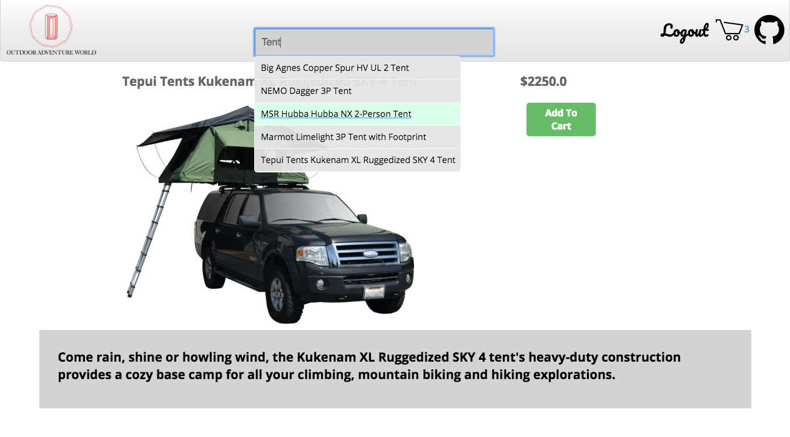
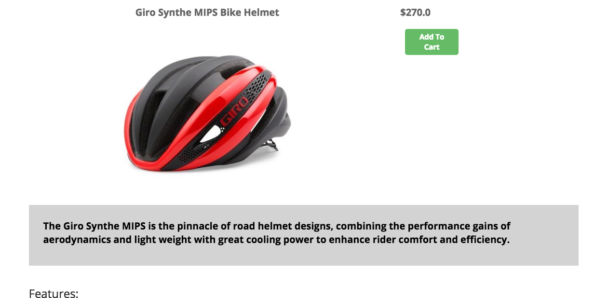
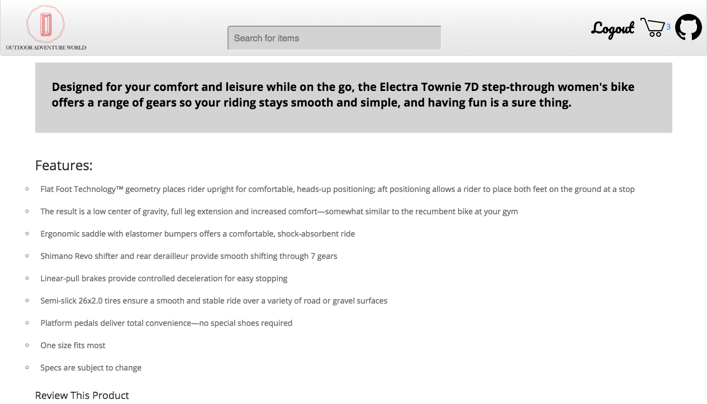
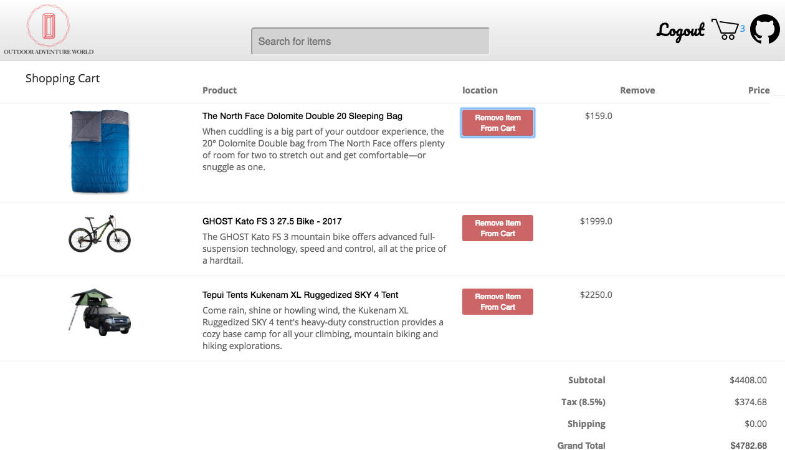

# Outdoor Adventure World


[Outdoor Adventure World live][heroku]

[heroku]: https://outdoor-adventure-world.herokuapp.com/#/signup


Outdoor-Adventure-World is a web application inspired by MooseJaw. In contrast to the Moosejaw website, Outdoor-Adventure-World is a single page application that runs off a static page using the React-Redux cycle. My site only re-renders individual components as needed due to changes in slices of the state.
Outdoor-Adventure-World is built on a PostgreSQL database, with a Ruby on Rails back-end. I use Jbuilder to generate JSON objects for the front-end, which is written in Javascript using React and Redux to maintain the single page application.


# Features & Implementation


### User Authentication

Outdoor-Adventure-World tracks a user with a session cookie which persists while refreshing or closing the window. I have implemented this with code that exists in both the front-end and back-end of the application. Upon log in or sign up the back-end resets a users session token, and creates a new cookie to hold a unique session token. This is then stored in the user's browser and in the PostgreSQL database. When the browser receives a successful server response the user's name and id are stored in the window's local storage.

The password is never saved anywhere. The back-end encrypts the password using a base-64 encoded hash string(A bcrypt hash). This is also salted with a 128-bit salt to protect against attacks using a rainbow table.
Upon logging out the session token in the database is reset. The cookies value is set to nil.

As long as the user allows the cookie to persist in local storage, refreshing and closing the window will not cause the user to lose access to their cart or credentials. If a user is present on page load React will retrieve the user's additional information. So long as the users session token is in the database the back-end will return all relevant information. As a result users who do not log out will not need to log in again upon refreshing or re-opening the page.
Malicious users attempting to impersonate others by filling their own window's local storage with a user object will not be able to gain authorization from the back-end.


### Persistent Shopping Cart

Items added to the shopping cart are maintained in a join table on the back-end. By storing a cart for each user on the back-end, tying a users id with a products id. I am able to maintain a users checkout cart even if they leave the website and return hours later, even on a different machine with a different browser.

When a user logs in, any products previously added to their cart are pulled from the back-end and merged with the front-end state allowing the information to be displayed in the navigation bar(header) and the checkout page. As a result a user can log out and return to the website maintaining their shopping cart.

I built a custom route and action in the controller to remove all cart products a user has when they complete an action, to reduce the number of Ajax requests to my Rack middleware and back-end controllers.

```ruby
Rails.application.routes.draw do
  namespace :api, defaults: {format: :json} do
    resources :users, only: [:create]
    resource :sessions, only: [:create, :destroy]
    resources :messages, only: [:create, :destroy, :update, :index]
    resources :products, only: [:index, :show]
    resources :carts, only: [:create, :index, :destroy, :show]
    delete "/user/cart/", to: "carts#destroy_all"
  end
  root "static_pages#root"
end
```

### Search Bar Utilizing Query Strings

The search bar located in the header of the website, permits a user to enter their own search terms. They may search by brand name or product name. This input is updated on keypress and the search initiated.
The search is handled on the back-end which takes the user input and strips it of case, white-space, and special characters. A query string is created with this input for the database and the controller returns to the front-end a list of products matching the request.


# Screenshots

## Search



## Product Display Page



## Product Features Page



## Shopping Cart



# Future Directions for the Project

### Search Bar
A sidebar filter for results by a polymorphic tag table on the backend ie: Bikes, Camping, Winter Sports, etc.

### More Seeds
Ties in with almost every other feature. Provide more data on the site to view.

### Past Purchases
Keep track of past purchases to auto populate an index page with goods matching tags on purchased items.

### Shopping Cart Cookie
To track products in a cart of someone not logged in, allowing them to log in and then reach checkout.
